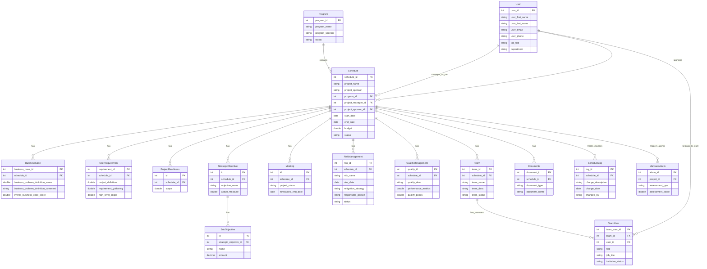

# Schedule Entity Relationship Diagram

This document shows the relationships between the Schedule entity and all related entities in the ePMO system.

## Entity Relationship Diagram

## Relationship Descriptions

### Direct Relationships (Foreign Key to Schedule)

1. **BusinessCase** → Schedule (Many-to-One)
   - Each business case belongs to one schedule/project
   - Contains financial assessments, strategic impact, and problem definitions

2. **UserRequirement** → Schedule (Many-to-One)
   - Stores project requirements and their scores
   - Links requirement gathering to specific projects

3. **ProjectReadiness** → Schedule (Many-to-One)
   - Tracks readiness metrics for various project aspects
   - Monitors project preparation status

4. **StrategicObjective** → Schedule (Many-to-One)
   - Links strategic objectives to specific projects
   - Tracks objective achievement and measures

5. **Meeting** → Schedule (Many-to-One)
   - Records project meetings and status updates
   - Tracks project progress over time

6. **RiskManagement** → Schedule (Many-to-One)
   - Manages risks associated with specific projects
   - Tracks mitigation strategies and responsible parties

7. **QualityManagement** → Schedule (Many-to-One)
   - Monitors quality metrics for projects
   - Tracks quality performance and corrective actions

8. **Team** → Schedule (Many-to-One)
   - Associates teams with specific projects
   - Manages team composition and status

9. **Documents** → Schedule (Many-to-One)
   - Links project documents to schedules
   - Organizes project-related documentation

10. **ScheduleLog** → Schedule (Many-to-One)
    - Tracks all changes made to schedules
    - Provides audit trail for project modifications

### Indirect Relationships

1. **Program → Schedule** (One-to-Many)
   - Programs contain multiple projects/schedules
   - Provides program-level organization

2. **User → Schedule** (One-to-Many)
   - Users can be project managers or sponsors
   - Links human resources to projects

3. **MarqueeAlarm ← Schedule** (Many-to-One via project_id)
   - Alarms are triggered based on project assessments
   - Provides early warning system for project issues

4. **SubObjective ← StrategicObjective** (Many-to-One)
   - Indirectly related to Schedule through StrategicObjective
   - Breaks down strategic objectives into measurable components

## Key Insights

- **Schedule** is the central entity in the project management system
- Most project-related data flows through the Schedule entity
- The system supports hierarchical organization (Program → Schedule → Sub-entities)
- Comprehensive tracking of project aspects (risks, quality, requirements, etc.)
- Strong audit capabilities through ScheduleLog
- Team management integrated with project scheduling
