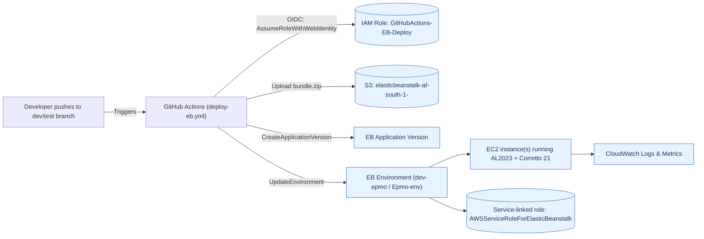
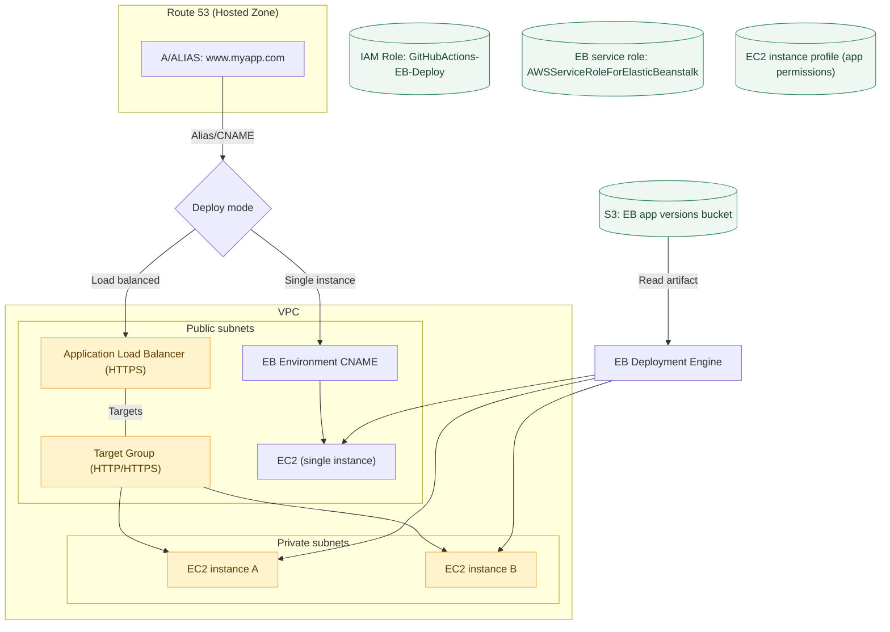
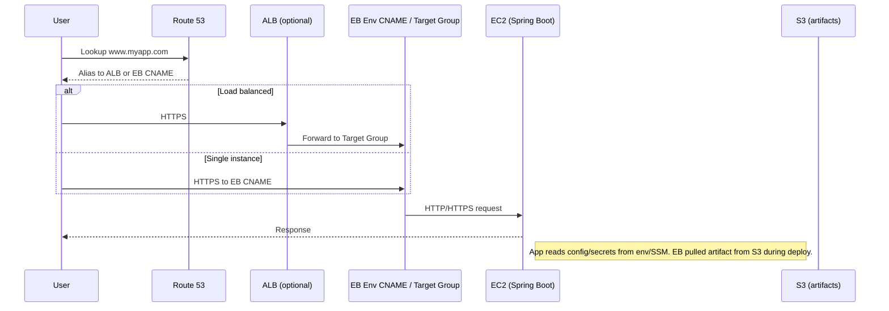

# HOW WE AUTOMATED THE BACKEND DEPLOYMENT

Technologies

* Spring Boot 3.3.2
* GitHub Actions (YAML)
* AWS Elastic Beanstalk (AL2023 + Corretto 21)
* AWS IAM OIDC (no long‑lived keys)
* S3 for EB application versions

---

## Architecture (at a glance)

GitHub → (OIDC assume-role) → IAM Role → S3 (upload bundle) → EB **Application Version** → EB **Environment** (dev/test)

> Branch mapping used:
>
> * `dev` → EB env **dev-epmo**
> * `test` → EB env **Epmo-env**
> * `main` → reserved for future production

---

## STEP 1: Create an AWS IAM role for GitHub Actions (OIDC)

> Goal: let GitHub Actions deploy to your EB envs **without** long‑lived AWS keys.

### A) Add the GitHub OIDC identity provider (once per AWS account)

AWS Console → **IAM → Identity providers → Add provider → OpenID Connect**
**Provider URL:** `https://token.actions.githubusercontent.com` → **Get thumbprint**
**Audience:** `sts.amazonaws.com` → **Add provider**


### B) Create the deploy role (assumed by your workflows)

**IAM → Roles → Create role → Web identity**
**Identity provider:** `token.actions.githubusercontent.com`
**Audience:** `sts.amazonaws.com`


#### Trust policy

Paste this JSON, and adjust the `Principal` account ID and the `sub` to restrict to your organization/repo/branches as you prefer.

> ✅ What does this policy do?
> It lets GitHub Actions assume the role using **short‑lived** OIDC tokens (no stored AWS keys). The `sub` selector limits which repos/branches may assume it.

```json
{
  "Version": "2012-10-17",
  "Statement": [
    {
      "Effect": "Allow",
      "Principal": {
        "Federated": "arn:aws:iam::557690591577:oidc-provider/token.actions.githubusercontent.com"
      },
      "Action": "sts:AssumeRoleWithWebIdentity",
      "Condition": {
        "StringEquals": {
          "token.actions.githubusercontent.com:aud": "sts.amazonaws.com"
        },
        "StringLike": {
          "token.actions.githubusercontent.com:sub": "repo:BITechAfrica/*"
        }
      }
    }
  ]
}
```

### C) Attach least‑privilege permissions

Attach an **inline policy** granting EB + S3 + minimal CFN/ASG reads, plus the small extras we discovered in troubleshooting (ACLs, bucket policy, and temporary CreateBucket for first run). Replace values if needed.

```json
{
  "Version": "2012-10-17",
  "Statement": [
    {"Sid": "ElasticBeanstalkCore", "Effect": "Allow", "Action": [
      "elasticbeanstalk:CreateApplicationVersion",
      "elasticbeanstalk:UpdateEnvironment",
      "elasticbeanstalk:Describe*",
      "elasticbeanstalk:List*"
    ], "Resource": "*"},

    {"Sid": "S3AppVersionObjects", "Effect": "Allow", "Action": [
      "s3:PutObject","s3:GetObject","s3:DeleteObject","s3:AbortMultipartUpload"
    ], "Resource": "arn:aws:s3:::elasticbeanstalk-af-south-1-557690591577/*"},

    {"Sid": "S3BucketOwnershipControls", "Effect": "Allow", "Action": [
      "s3:GetBucketOwnershipControls","s3:PutBucketOwnershipControls"
    ], "Resource": "arn:aws:s3:::elasticbeanstalk-af-south-1-557690591577"},

    {"Sid": "S3ListBucket", "Effect": "Allow", "Action": "s3:ListBucket",
     "Resource": "arn:aws:s3:::elasticbeanstalk-af-south-1-557690591577"},

    {"Sid": "S3CreateBucketOnce", "Effect": "Allow", "Action": "s3:CreateBucket", "Resource": "*"},

    {"Sid": "CloudFormationReadForEB", "Effect": "Allow", "Action": [
      "cloudformation:GetTemplate","cloudformation:GetTemplateSummary",
      "cloudformation:DescribeStacks","cloudformation:DescribeStackEvents",
      "cloudformation:DescribeStackResource","cloudformation:DescribeStackResources",
      "cloudformation:ListStackResources"
    ], "Resource": "*"},

    {"Sid": "AutoScalingReadOnly", "Effect": "Allow", "Action": [
      "autoscaling:DescribeAutoScalingGroups","autoscaling:DescribeAutoScalingInstances",
      "autoscaling:DescribeScalingActivities","autoscaling:DescribeLaunchConfigurations",
      "autoscaling:DescribePolicies"
    ], "Resource": "*"},

    {"Sid": "S3AclReadWriteForEB", "Effect": "Allow", "Action": [
      "s3:GetObjectAcl","s3:PutObjectAcl"
    ], "Resource": "arn:aws:s3:::elasticbeanstalk-af-south-1-557690591577/*"},

    {"Sid": "S3BucketPolicyRead", "Effect": "Allow", "Action": ["s3:GetBucketPolicy"],
     "Resource": "arn:aws:s3:::elasticbeanstalk-af-south-1-557690591577"},

    {"Sid": "EBRestartAppServer", "Effect": "Allow", "Action": ["elasticbeanstalk:RestartAppServer"],
     "Resource": [
       "arn:aws:elasticbeanstalk:af-south-1:557690591577:environment/epmo/dev-epmo",
       "arn:aws:elasticbeanstalk:af-south-1:557690591577:environment/epmo/Epmo-env"
     ]},

    {"Sid": "AutoScalingSuspendResumeForEB", "Effect": "Allow", "Action": [
      "autoscaling:SuspendProcesses","autoscaling:ResumeProcesses"
    ], "Resource": "arn:aws:autoscaling:af-south-1:557690591577:autoScalingGroup:*:autoScalingGroupName/awseb-e-jkur3dpkrc-stack-AWSEBAutoScalingGroup-FbRZ2dlHSi3t"}
  ]
}
```

> 🔒 **Hardening later**: after your first green deploy, you can remove `S3CreateBucketOnce`. You can also narrow ASG/EB resources to exact ARNs.

---

## STEP 2: Ensure EB Service Role is attached to each environment

EB needs its own service‑linked role for internal actions (incl. ASG ops even on single‑instance envs).

```bash
# One-time (safe to re-run):
aws iam create-service-linked-role --aws-service-name elasticbeanstalk.amazonaws.com || true

# Check what the env uses now:
aws elasticbeanstalk describe-configuration-settings \
  --application-name epmo \
  --environment-name dev-epmo \
  --query "ConfigurationSettings[0].OptionSettings[?Namespace=='aws:elasticbeanstalk:environment' && OptionName=='ServiceRole'].Value" \
  --output text

# If empty/None, attach the service role:
aws elasticbeanstalk update-environment \
  --environment-name dev-epmo \
  --option-settings Namespace=aws:elasticbeanstalk:environment,OptionName=ServiceRole,Value=arn:aws:iam::557690591577:role/aws-service-role/elasticbeanstalk.amazonaws.com/AWSServiceRoleForElasticBeanstalk
```

Repeat for `Epmo-env` if you have a QA environment.

---

## STEP 3: Repo variables & branch strategy

**Branch → Environment**

* `dev` → `dev-epmo`
* `test` → `Epmo-env`

**Repository → Settings → Secrets and variables → Actions → Variables**

* `AWS_ROLE_ARN` → `arn:aws:iam::<ACCOUNT_ID>:role/GitHubActions-EB-Deploy`
* `EB_APP_NAME` → your EB Application name (e.g., `epmo`)
* `EB_BUCKET` → EB artifacts bucket in `af-south-1` (e.g., `elasticbeanstalk-af-south-1-<ACCOUNT_ID>`)

> Optionally also set **branch protections** so only PRs advance from feature → `dev` → `test`.

---

## STEP 4: GitHub Actions workflow

Create `.github/workflows/deploy-eb.yml`:

> If your Spring project lives in a subfolder (e.g., `epmo/`), keep the `cd epmo` lines. Otherwise remove them.

```yaml
name: Deploy to Elastic Beanstalk

on:
  push:
    branches: [ "dev", "test" ]

concurrency:
  group: eb-${{ github.ref }}
  cancel-in-progress: true

permissions:
  id-token: write
  contents: read

env:
  AWS_REGION: af-south-1
  EB_APP_NAME: ${{ vars.EB_APP_NAME }}
  EB_BUCKET:   ${{ vars.EB_BUCKET }}

jobs:
  build-and-deploy:
    runs-on: ubuntu-latest

    steps:
      - name: Checkout
        uses: actions/checkout@v4

      - name: Set up Java
        uses: actions/setup-java@v4
        with:
          distribution: temurin
          java-version: '21'

      - name: Gradle (build jar)
        uses: gradle/actions/setup-gradle@v3
      - run: |
          cd epmo
          chmod +x gradlew
          ./gradlew clean bootJar --no-daemon
          ls -lah build/libs

      - name: Prepare EB source bundle
        run: |
          JAR_PATH=$(ls epmo/build/libs/*SNAPSHOT.jar 2>/dev/null || ls epmo/build/libs/*.jar | head -n1)
          echo "Jar detected: $JAR_PATH"
          cp "$JAR_PATH" application.jar
          echo "web: java -jar application.jar" > Procfile
          zip -j bundle.zip application.jar Procfile
          ls -lah

      - name: Configure AWS credentials (OIDC)
        uses: aws-actions/configure-aws-credentials@v4
        with:
          role-to-assume: ${{ vars.AWS_ROLE_ARN }}
          aws-region: ${{ env.AWS_REGION }}

      - name: Select EB environment for this branch
        id: select-env
        run: |
          BR="${GITHUB_REF##*/}"
          if [ "$BR" = "dev" ]; then
            echo "env_name=dev-epmo" >> "$GITHUB_OUTPUT"
          elif [ "$BR" = "test" ]; then
            echo "env_name=Epmo-env" >> "$GITHUB_OUTPUT"
          else
            echo "Unsupported branch: $BR"; exit 1
          fi

      - name: Version label (unique)
        id: ver
        run: |
          echo "label=gh-${GITHUB_SHA::7}-${GITHUB_RUN_ID}-${GITHUB_RUN_ATTEMPT}-$(date +%s)" >> $GITHUB_OUTPUT

      - name: Upload bundle to S3
        run: |
          KEY="${{ env.EB_APP_NAME }}/${{ steps.ver.outputs.label }}.zip"
          aws s3 cp bundle.zip "s3://${{ env.EB_BUCKET }}/${KEY}"
          echo "S3Key=$KEY"

      - name: Create or reuse EB application version
        run: |
          APP="${{ env.EB_APP_NAME }}"
          VER="${{ steps.ver.outputs.label }}"
          KEY="${{ env.EB_APP_NAME }}/${{ steps.ver.outputs.label }}.zip"

          EXISTS=$(aws elasticbeanstalk describe-application-versions \
            --application-name "$APP" --version-labels "$VER" \
            --query 'ApplicationVersions[0].VersionLabel' --output text || true)

          if [ "$EXISTS" = "$VER" ]; then
            echo "ℹ️ EB app version '$VER' already exists; reusing."
          else
            aws elasticbeanstalk create-application-version \
              --application-name "$APP" \
              --version-label "$VER" \
              --source-bundle S3Bucket="${{ env.EB_BUCKET }}",S3Key="$KEY"
          fi

      - name: Deploy to EB + wait for target label
        run: |
          ENV="${{ steps.select-env.outputs.env_name }}"
          VER="${{ steps.ver.outputs.label }}"

          echo "Deploying version '$VER' to environment '$ENV'..."
          aws elasticbeanstalk update-environment --environment-name "$ENV" --version-label "$VER"

          echo "Waiting for environment to reach Ready/Green and VersionLabel='$VER'..."
          for i in $(seq 1 40); do
            STATUS=$(aws elasticbeanstalk describe-environments --environment-names "$ENV" --query "Environments[0].Status" --output text)
            HEALTH=$(aws elasticbeanstalk describe-environments --environment-names "$ENV" --query "Environments[0].Health" --output text)
            CURVER=$(aws elasticbeanstalk describe-environments --environment-names "$ENV" --query "Environments[0].VersionLabel" --output text)
            echo "[$i] Status=$STATUS Health=$HEALTH Version=$CURVER"
            if [ "$STATUS" = "Ready" ] && [ "$HEALTH" = "Green" ] && [ "$CURVER" = "$VER" ]; then
              echo "✅ Deployed $VER to $ENV"; exit 0
            fi
            sleep 15
          done

          echo "❌ Timed out waiting for $ENV to reach $VER. Recent EB events:"
          aws elasticbeanstalk describe-events --environment-name "$ENV" --max-items 50 --query "Events[].[EventDate,Severity,Message]" --output table
          exit 1
```

> ✅ This workflow builds the jar, zips it with a `Procfile`, uploads to S3, creates (or reuses) an EB **Application Version**, deploys it to the correct environment, and **waits until** the env is Ready/Green **and** on that exact version label.

---

## STEP 5 (optional): PR guard for `test`

Only allow PRs into `test` **from `dev`**.

`.github/workflows/pr-guard-test.yml`

```yaml
name: PR Guard (test)

on:
  pull_request:
    branches: [ "test" ]

jobs:
  ensure-from-dev:
    runs-on: ubuntu-latest
    steps:
      - name: Only allow PRs into test from dev
        run: |
          if [ "${{ github.head_ref }}" != "dev" ]; then
            echo "❌ PRs to 'test' must come from 'dev'. Found: '${{ github.head_ref }}'"; exit 1
          fi
          echo "✅ Allowed: PR source is 'dev'"
```

Then make it **Required** under Branch Protection for `test`.

---

## STEP 6 (optional but recommended): Add a small swap file

Avoid OOM flaps on small instances by adding a 2GB swap post‑deploy hook.

`.platform/hooks/postdeploy/10-swap.sh`

```bash
#!/usr/bin/env bash
set -euo pipefail
SWAPFILE="/swapfile"; SIZE_GB="${SWAP_SIZE_GB:-2}"
if swapon --show | grep -q "$SWAPFILE"; then exit 0; fi
if [ ! -f "$SWAPFILE" ]; then
  fallocate -l "${SIZE_GB}G" "$SWAPFILE" || dd if=/dev/zero of="$SWAPFILE" bs=1G count="$SIZE_GB"
  chmod 600 "$SWAPFILE"; mkswap "$SWAPFILE"; fi
swapon "$SWAPFILE"; grep -q "^$SWAPFILE" /etc/fstab || echo "$SWAPFILE swap swap defaults 0 0" >> /etc/fstab
sysctl -w vm.swappiness=10; sysctl -w vm.vfs_cache_pressure=50
```

> Commit as executable: `git update-index --chmod=+x .platform/hooks/postdeploy/10-swap.sh`.

---

## STEP 7: Move secrets out of `application.properties`

Use **EB environment variables** (Configuration → Software) or **SSM Parameter Store**.

### A) Environment variables (quickest)

Set keys like:

```
spring_profiles_active=prod-dev
SPRING_DATASOURCE_URL=jdbc:mariadb://.../innodb
SPRING_DATASOURCE_USERNAME=...
SPRING_DATASOURCE_PASSWORD=...
SPRING_MAIL_HOST=...
AWS_REGION=af-south-1
...
```

Spring Boot reads these automatically (relaxed binding) or via `${ENV_VAR}` placeholders.

### B) SSM Parameter Store (secure)

Store `/epmo/SPRING_DATASOURCE_PASSWORD` etc., attach instance role perms, and load via a bootstrap or a small config class. (You can also mount with EB `.ebextensions` or use the AWS SDK at startup.)

> **Rotate** any secrets that were previously committed to properties files.

---

## Troubleshooting (what we actually hit)

* **Incorrect application version … Expected version**
  Usually EB couldn’t apply the new version because of S3/ASG permissions. Fix the underlying denial (see below) and the workflow will converge to the target version.

* **S3 ACL / bucket policy errors**
  Add: `s3:PutObjectAcl`, `s3:GetObjectAcl`, `s3:GetBucketPolicy`, `s3:Get/PutBucketOwnershipControls` on the EB bucket. Ensure `EB_BUCKET` var matches the real bucket name.

* **CloudFormation read denied**
  Add `cloudformation:GetTemplate*` and basic `Describe*` rights. EB surfaces many deploy issues through its CFN stack.

* **Auto Scaling Suspend/Resume denied** (even Single instance)
  Attach EB service role to the environment. If EB still calls with caller creds, grant `autoscaling:SuspendProcesses` + `ResumeProcesses` for the env’s ASG ARN to your GitHub role.

* **First run needs CreateBucket**
  Allow `s3:CreateBucket` (Resource `*`) temporarily until the EB artifacts bucket exists.

* **High memory (96%+) causing flaps**
  Add the swap hook above and/or right‑size the instance.

* **Custom domain**
  Restarts/updates don’t break DNS. `www.myapp.com` should CNAME (or alias A) to the EB environment CNAME.

Useful commands:

```bash
# Describe env status/health/version
aws elasticbeanstalk describe-environments --environment-names dev-epmo \
  --query "Environments[0].[Status,Health,VersionLabel,CNAME]" --output table

# Recent EB events
aws elasticbeanstalk describe-events --environment-name dev-epmo \
  --max-items 50 --query "Events[].[EventDate,Severity,Message]" --output table
```

---

## Security hardening checklist

* Lock trust policy to **exact repo** and **branches** (e.g., `repo:ORG/REPO:ref:refs/heads/dev`).
* Narrow S3/ASG/EB **Resource** ARNs where practical.
* Remove `s3:CreateBucket` after first success.
* Use **OIDC** only (no static keys in GitHub).
* Store app secrets in **EB env vars** or **SSM**, not in Git.

---

## Done ✅

Pushing to `dev` now builds → packages → uploads → **creates EB application version** → **deploys to `dev-epmo`** → waits for Ready/Green **and** exact VersionLabel. Same flow for `test` → `Epmo-env`.

If you want a production path later, mirror the `test` setup with `main` → `prod` (and add a manual approval gate if needed).

## Architecture — detailed sketches

### 1) CI/CD deployment pipeline (GitHub → EB)


> **Notes**
> - OIDC removes the need for long‑lived AWS keys in GitHub.  
> - The workflow labels each build (e.g., `gh-<sha>-<run>-<attempt>-<ts>`), uploads to S3, creates an **EB Application Version**, and deploys it to the selected **Environment**.

---

### 2) Runtime topology (DNS, VPC, ALB / Single instance, target group)


**Legend & notes**
- **Route 53** resolves `www.myapp.com` to either the **EB CNAME** (single instance) or an **ALB** (load‑balanced).  
- **VPC** contains your EB instances. In load‑balanced mode, the **ALB** forwards to a **Target Group** of EC2 instances; in single‑instance mode, Route 53 can alias directly to the **EB CNAME** which points to the instance.
- **S3 EB bucket** stores the uploaded `bundle.zip` and EB’s staged copies.
- **IAM Roles**:
  - *GitHubActions-EB-Deploy* (assumed via OIDC) to create app versions & kick off deploys.
  - *AWSServiceRoleForElasticBeanstalk* used by EB to perform internal operations (incl. ASG calls even on single‑instance).
  - *EC2 instance profile* for app‑level AWS access (e.g., S3, SSM) if required.
- **Security groups**: ALB, EC2, and DB/other services should each have tight SGs allowing only necessary traffic.
- **TLS**: Use ACM certs on the ALB (or on EB if terminating at instance).
- **Secrets**: Prefer EB **environment variables** or **SSM Parameter Store**; avoid committing secrets.

---

### 3) Request path (sequence)


---

### Resource map (quick reference)

| Layer | Service | What it does |
|---|---|---|
| DNS | Route 53 | Public DNS; ALIAS/CNAME for `www.myapp.com` |
| Edge/LB | **ALB** *(optional)* | TLS termination & routing to target group |
| Compute | Elastic Beanstalk | Manages EC2s, deployments, health |
| Compute | EC2 (AL2023 + Corretto 21) | Runs Spring Boot JAR |
| Storage | S3 (EB bucket) | Stores `bundle.zip` and EB staged copies |
| IAM | GitHubActions-EB-Deploy | Assumed via OIDC by GitHub Actions |
| IAM | AWSServiceRoleForElasticBeanstalk | EB’s service‑linked role for internal ops |
| IAM | EC2 instance profile | App’s AWS permissions (optional) |
| Observability | CloudWatch | Logs/metrics/alarms |
| Networking | VPC, subnets, SGs | Isolation and traffic control |
